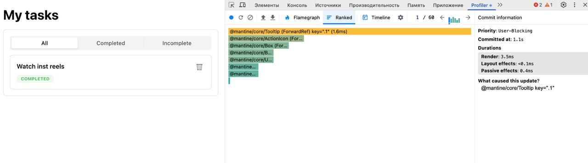
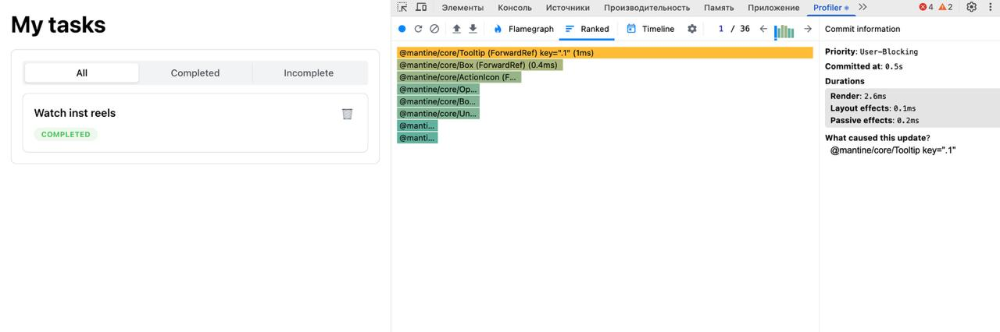
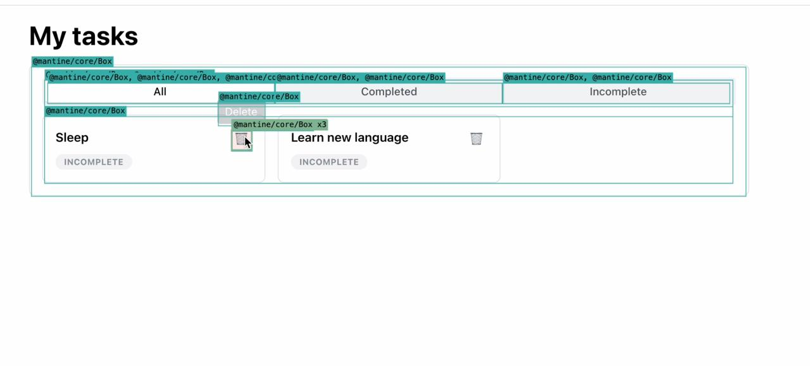
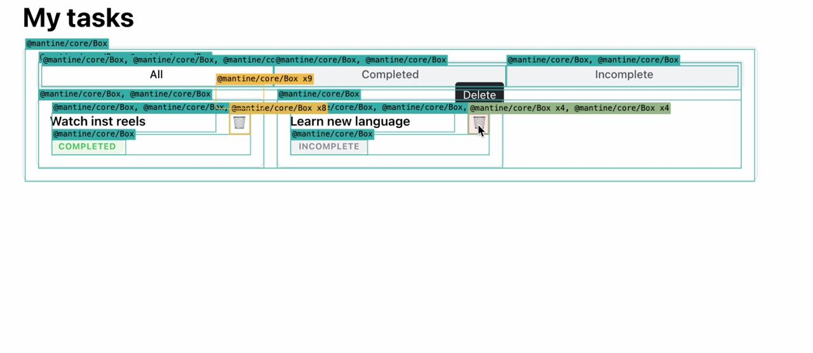
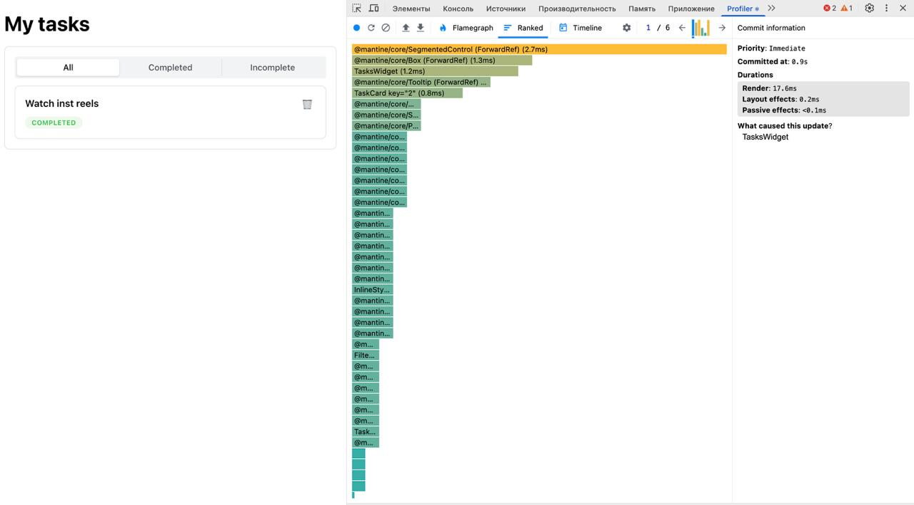
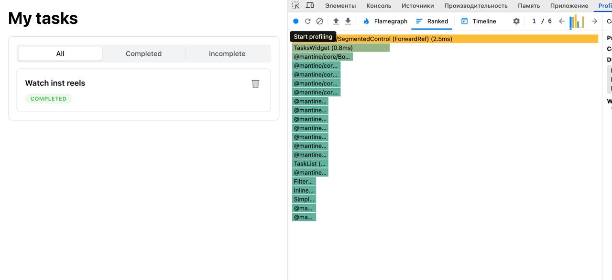

## Для ДЗ 2

Ниже — сравнение производительности до/после оптимизаций:
- `TaskCard` обёрнут в `memo`
- `removeTask` обёрнут в `useCallback`

### 1) Удаление задачи: время рендера до/после

Видно более высокое время рендеринга при удалении задачи: перерисовывается больше компонентов.

После мемоизации `TaskCard` и оборачивания `removeTask` в `useCallback` видно уменьшение времени рендера и меньше лишних перерисовок.

### 2) Подсветка ререндеров (Highlight updates): до/после

Подсветка показывает, что при удалении задачи перерисовываются все карточки и внешние блоки.

После оптимизаций подсветка показывает меньше ререндеров: обновляются только внешние блоки, а не сами карточки.

### 3) Переключение фильтров (табы): время рендера до/после

При смене табов фильтра заметно большее время рендера компонентов.

После применения мемоизации видно уменьшение времени рендера компонентов при переключении табов.

